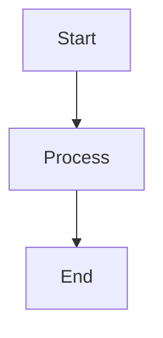

# Snacks.nvim Image

The image module provides image viewing support in Neovim, allowing you to display and preview images directly in the editor.

## Features

- **Image Rendering**: Display images directly in Neovim buffers
- **Multiple Formats**: Support for PNG, JPEG, GIF, and other common formats
- **Terminal Integration**: Works with compatible terminals
- **Markdown Integration**: Preview images in markdown files
- **LaTeX Support**: Render LaTeX math expressions as images
- **Diagram Support**: Render Mermaid diagrams and other diagram formats

## Prerequisites

The image module requires specific terminal emulators and external tools:

### Supported Terminals
- **Kitty**: Full image protocol support
- **WezTerm**: Graphics protocol support  
- **Ghostty**: Image rendering support

### Required External Tools
- **ImageMagick** (`magick` or `convert`): Image format conversion
- **Ghostscript** (`gs`): PDF rendering support
- **Tectonic** or **pdflatex**: LaTeX math expression rendering
- **Mermaid CLI** (`mmdc`): Mermaid diagram rendering

## Configuration

The image module is enabled by default but requires compatible terminal and tools:

```lua
require('snacks').setup({
  image = { enabled = true }
})
```

### Advanced Configuration

```lua
image = {
  enabled = true,
  backend = "kitty",        -- or "wezterm", "ghostty"
  integrations = {
    markdown = true,        -- Show images in markdown
    neorg = true,          -- Neorg document support
  },
  max_width = 300,         -- Maximum image width
  max_height = 200,        -- Maximum image height
  window_overlap_clear_enabled = true,
  window_overlap_clear_ft_ignore = { "cmp_menu", "cmp_docs", "" },
}
```

## Installation Requirements

Since you're using Windows Terminal with WSL2, image rendering has limitations:

### Current Status
Based on the health check output:
- ❌ No compatible terminal found (`kitty`, `wezterm`, `ghostty`)
- ❌ ImageMagick not available (`magick`, `convert`) 
- ❌ Ghostscript not found (`gs`)
- ❌ LaTeX tools missing (`tectonic`, `pdflatex`)
- ❌ Mermaid CLI not found (`mmdc`)
- ❌ Windows Terminal doesn't support kitty graphics protocol

### Setup for WSL2 + Windows Terminal

Unfortunately, Windows Terminal doesn't support the graphics protocols needed for image rendering. To use image features, you would need to:

1. **Switch Terminal**: Use WezTerm or install Kitty in WSL2
2. **Install Dependencies**:
   ```bash
   # In your NixOS configuration
   environment.systemPackages = with pkgs; [
     imagemagick
     ghostscript  
     tectonic      # or texlive.combined.scheme-basic
     mermaid-cli
   ];
   ```

## Usage (When Properly Configured)

### Basic Image Commands

- `:lua Snacks.image.show("path/to/image.png")` - Display image
- `:lua Snacks.image.clear()` - Clear displayed images
- `:lua Snacks.image.toggle()` - Toggle image display

### Markdown Integration

When properly configured, images in markdown files will automatically display:

```markdown

```

### LaTeX Math Rendering

Mathematical expressions can be rendered as images:

```latex
$$E = mc^2$$
```

### Mermaid Diagrams

Mermaid diagrams can be rendered:



## Limitations in Current Setup

Given your Windows Terminal + WSL2 environment:

1. **No Image Display**: Windows Terminal lacks graphics protocol support
2. **Missing Tools**: ImageMagick and other tools not installed
3. **Performance Impact**: Image rendering can slow down larger files

## Alternative Solutions

For your current setup, consider:

1. **External Viewers**: Use system image viewers for image files
2. **Web Preview**: Use markdown preview plugins for HTML rendering
3. **Terminal Upgrade**: Consider switching to WezTerm for better graphics support

## Testing

To test if image support could work:

1. Check terminal capabilities: `:lua print(vim.env.TERM)`
2. Verify tool availability: `:!which magick`
3. Run health check: `:checkhealth snacks`
4. Test with small PNG: `:lua Snacks.image.show("test.png")`

## Benefits (When Available)

- **Visual Preview**: See images without leaving Neovim
- **Markdown Enhancement**: Rich markdown preview with images
- **Documentation**: Visual documentation with embedded diagrams
- **Development**: Preview generated images and plots
- **Academic Writing**: LaTeX math rendering for scientific documents